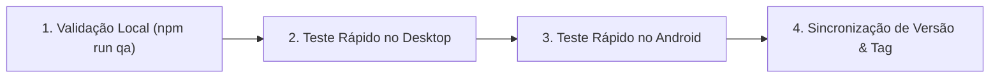

# 🛡️ Guia de QA e Checklist de Aceitação Pré-Release — DriveGram

Este documento define o processo obrigatório de **Garantia de Qualidade (QA)** do DriveGram para assegurar que novas versões sejam publicadas sem quebras, regressões ou comportamentos inesperados no **Windows Desktop (Tauri)** ou no **Android (Capacitor/Node.js Mobile)**.

---

## 🎯 Regra de Ouro
> **NUNCA crie uma tag `vX.Y.Z` ou realize o merge na branch `main` sem que todos os passos abaixo tenham sido concluídos e validados.**
> 
> A tag dispara imediatamente o workflow de compilação e publicação final no GitHub Actions. Se algo estiver quebrado, a versão com defeito será empacotada e disponibilizada para os usuários.

---

## 📋 Fluxo de QA em 4 Etapas



---

### Etapa 1: Validação Automatizada Local (`npm run qa`)

Antes de qualquer teste manual, execute no terminal do projeto:

```bash
npm run qa
```

Este comando executa a esteira automática:
1. `tsc && vite build`: Valida tipagem estática e compilação do frontend React/Vite.
2. `npm run package:embedded`: Empacota o servidor backend TypeScript em um bundle único com `esbuild`.
3. `npm run test:smoke`: Inicia o bundle gerado em uma porta isolada (`5099`), testa o banco de dados e as rotas críticas (`/api/health`, `/api/status`, `/api/folders`, `/api/telegram/status`) e encerra o processo de forma limpa.

> ⚠️ **Se o comando falhar com erro vermelho, corrija o problema antes de prosseguir!**

---

### Etapa 2: Checklist Rápido de Fumaça no Desktop (Windows)

Abra o aplicativo em modo de teste ou compile o executável:
```bash
npm run desktop:dev
# ou gere o instalador final: npm run desktop:build
```

Execute o checklist de **3 a 5 minutos**:

| Item | O que testar? | Critério de Sucesso |
| :--- | :--- | :--- |
| **1. Inicialização** | Abrir o aplicativo Desktop | Janela abre sem tela preta/branca infinita; servidor embutido inicia na porta 5000. |
| **2. Conexão / Sessão** | Verificar status do Telegram | Se já conectado, exibe o nome/usuário; se desconectado, abre modal de login normalmente. |
| **3. Streaming de Mídia** | Clicar em um vídeo ou áudio do catálogo | A reprodução começa em poucos segundos sem travamentos ou buffer contínuo. |
| **4. Sistema de Arquivos** | Clicar no botão "Abrir Pasta" ou "Abrir Logs" | O Windows Explorer abre na pasta correta (`drivegram-data`). |
| **5. Encerramento Limpo** | Fechar a janela do aplicativo | O processo `node.exe` em segundo plano é encerrado e liberado (não fica preso no Gerenciador de Tarefas). |

---

### Etapa 3: Checklist Rápido de Fumaça no Android (Mobile)

Gere e instale o APK de debug no seu celular ou emulador:
```bash
npm run mobile:apk
```

Execute o checklist de **3 a 5 minutos**:

| Item | O que testar? | Critério de Sucesso |
| :--- | :--- | :--- |
| **1. Inicialização & Permissões** | Abrir o app no Android | App abre exibindo a splash e carregando a tela inicial. Status bar e navegação respeitam a área útil (safe area). |
| **2. Servidor Embutido** | Verificar ícone/indicador de status | O Node.js Mobile embarcado inicializa e responde localmente (`127.0.0.1:5000`). |
| **3. Reprodução / Player** | Tocar um vídeo ou áudio/podcast | Player abre e reproduz normalmente; controle de volume e tela cheia funcionam. |
| **4. Botão Voltar Físico** | Pressionar o botão "Voltar" do Android | Fecha modais/gavetas abertas; se estiver na tela raiz, pergunta se deseja sair ou sai suavemente. |
| **5. Segundo Plano** | Minimizar o app e reabrir após alguns segundos | O aplicativo não reinicia com crash e restaura o estado anterior. |

---

### Etapa 4: Sincronização Obrigatória de Versão (SemVer)

Antes de gerar a tag, confira se a versão foi incrementada nos **5 arquivos obrigatórios** (conforme `AGENTS.md`):

- [ ] `package.json` (`"version": "x.y.z"`)
- [ ] `src-tauri/tauri.conf.json` (`"version": "x.y.z"`)
- [ ] `android/app/build.gradle` (`versionName "x.y.z"` e **`versionCode` incrementado**)
- [ ] `src/utils/updater.ts` (`export const CURRENT_APP_VERSION = 'x.y.z';`)
- [ ] `server/index.ts` (`version: 'x.y.z'` na rota `/api/health`)

---

### Etapa 5: Merge na `main` e Disparo da Release

1. **Faça o commit e merge da sua branch na `main`:**
   ```bash
   git checkout main
   git merge feature/minha-feature
   git push origin main
   ```

2. **Crie a tag da versão com o prefixo `v`:**
   ```bash
   git tag -a vx.y.z -m "Release vx.y.z"
   ```

3. **Envie a tag para o GitHub para disparar a compilação do instalador Windows e APK:**
   ```bash
   git push origin vx.y.z
   ```

4. **Acompanhe o build no GitHub Actions**:
   - Acesse a aba **Actions** no repositório GitHub.
   - Aguarde os jobs `Build Android APK` e `Build Windows Desktop (Tauri)` concluírem com sucesso (ícone verde ✅).
   - O executável `.exe` e o pacote `.apk` estarão anexados na página de **Releases** do GitHub.
